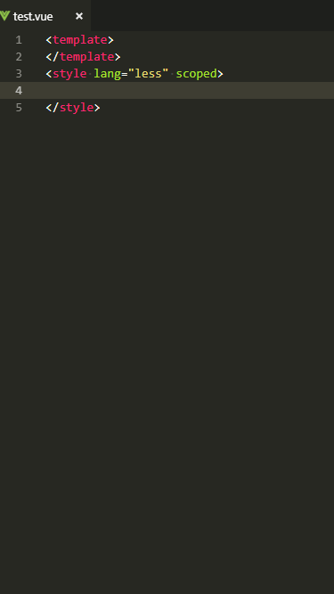

# autoHtml README

这是一个 `vscode` 插件，实时自动通过 `diff` 算法对比 `css tree` 和 `dom tree` 差异更新生成 `html` ，可解放绝大部分的 `html` 书写。

正在完善中，暂未发布到 `store`

## 演示

  

后代选择器 `.parent .grandchild` 和 子选择器 `.parent > .child` 都会先生成子节点，后代选择器生成的节点可自行改变层级，不会重复生成。